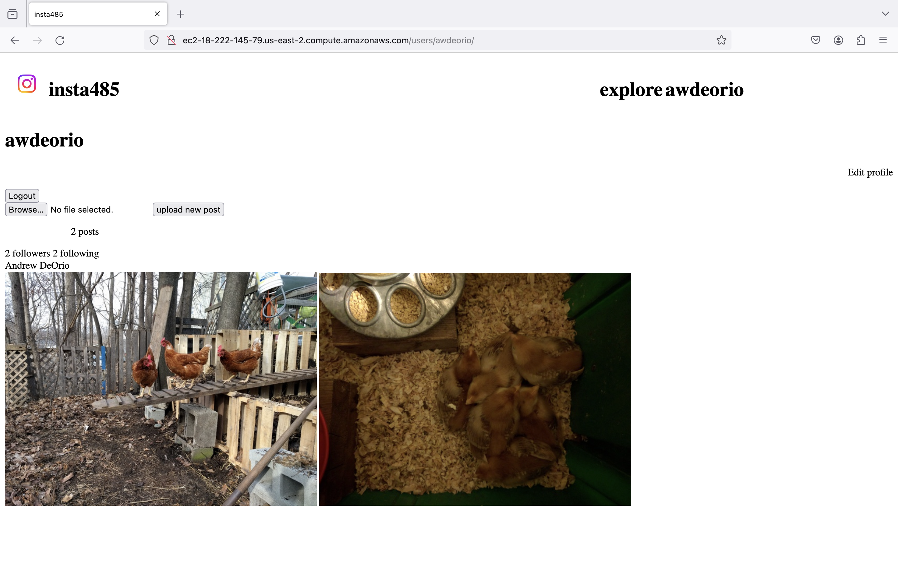

Insta485 🕸️
===========================
<h3>Description ✍️</h3>

A three-part project using a templated static site generator, server-side dynamic pages, and client-side dynamic pages to develop an Instagram clone.

<h4>Account page</h4>

<h4>Explore page</h4>

<h4>Follower post on homepage</h4>

<h2>Project 1: Templated Static Site Generator ⚙</h2>

<h3>Description ✍️</h3>

A Python backend that takes in HTML templates, JSON data, and miscellaneous static files (such as images and CSS) and generates a website of static content.

### Tools 🔨
- HTML
- CSS
- Jinja templates
- Python backend
- Shell scripting

<h2>Project 2: Server-side Dynamic Pages 📃</h2>

<h3>Description ✍️</h3>

Built an interactive website using server-side dynamic pages. Reused templates from Project 1, rendering them on-demand when a user loads a page. New features include creating; updating; deleting users, posts, comments, and likes; and secure sign-in with cookies provided by Flask sessions.

### Tools 🔨
- Server-side dynamic pages
- CRUD (Create, Read, Update, Delete)
- Flask
  - Sessions
- SQL database

<h2>Project 3: Client-side Dynamic Pages 📄</h2>

<h3>Description ✍️</h3>

Built an application using client-side dynamic pages and a REST API. Reused server-side code from project 2, refactoring portions into a REST API. Wrote a client application in JavaScript using React that runs in the browser and makes AJAX calls to a REST API.

### Tools 🔨
- Client-side dynamic pages
- JavaScript
  - React
- Asynchronous programming
  - AJAX
- REST APIs
- Command line
